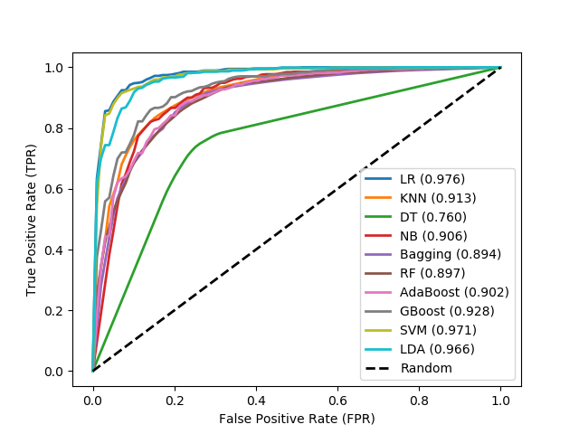

# Performance Measures on DNA Dataset

### DNA, trained on sigma70 dataset

&nbsp;

Table 1: Different classifiers achieved during cross-fold validation on sigma70 training dataset.

| Classifier | Accuracy (%) |  auROC | auPR   | Sn (%) |  Sp (%)  | F1-Score |  MCC   |
| :---       | :---:        | :---:  |  :---: | :---:  | :---:    | :---:    | ---:  |
|LR |92.88|0.9755|0.9789|93.79|91.90|0.9293|0.8583|
|SVM|91.50|0.9711|0.9738|92.31|90.69|0.9159|0.8306|
|KNN|84.63|0.9129|0.8858|83.40|85.96|0.8451|0.6954|
|Decision Tree|76.04|0.7604|0.6990|75.98|76.11|0.7601|0.5220|
|Naive Bayes|84.40|0.9061|0.8703|85.83|83.00|0.8420|0.6896|
|Bagging|82.11|0.8936|0.8641|80.16|84.08|0.8174|0.6439|
|Random Forest|82.16|0.8972|0.8741|78.95|85.43|0.8156|0.6466|
|AdaBoost|82.72|0.9023|0.8939|82.05|83.40|0.8264|0.6553|
|Gradient Boosting|85.15|0.9281|0.9293|86.64|83.67|0.8544|0.7050|
|LDA|90.28|0.9659|0.9702|91.63|88.93|0.9042|0.8067|

Note: The number of promoter (+ve) sequences and the number of non-promoter (-ve) sequences are 741 and 1400 respectively.

&nbsp;

Figure 1: Receiver Operation Characteristic (ROC) curve for different classifiers achieved during cross-fold
validation on sigma70 training dataset.

&nbsp;

We can [download](http://lin-group.cn/server/iPro70PseZNC/data.html) sigma70 dataset from the given link.
